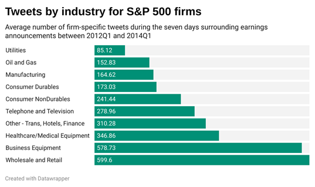
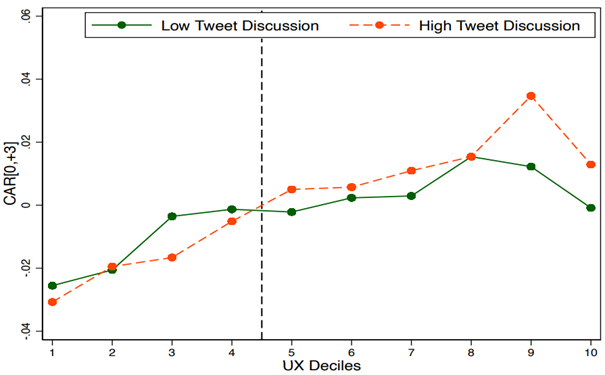

```{r setup, include=FALSE}
knitr::opts_chunk$set(echo = TRUE)
```

## Introduction

Launched in 2006, Twitter has grown in popularity to become one of the most frequently used microblogging and social networking sites. According to Statista, Twitter had 199 million monetizable daily active users worldwide as of the first quarter of 2021. Twitter has become a major information dissemination channel over the past decade. As key players in this new digital world, firms might exhibit strategic behavior to shape the information environment, influence capital markets participants' view of the firm and affect the price discovery process. This comes in the form of Twitter posts used by firms for announcement of major corporate events. Is it real though? Can tweets have this much effect? Let’s find out.

First, Twitter talk doesn’t apply to all firms. There are specific industries and firms that are more likely to be discussed on Twitter. They are mostly retail industries (especially B2C firms) whereas utility and manufacturing are less likely to be discussed on Twitter. In terms of firm characteristics, firms with bigger size, higher profitability, higher growth potential (market to book ratio) and more analyst coverage are more likely to be discussed on Twitter.

These firms use Twitter to talk about their earnings announcement, highlighting good news or simply mentioning that earnings will be/were announced. Analysts and people have an expectation of this earnings value, and they might differ - then we have an earnings surprise. A natural question then follows: can the pre-announcement tweet tones predict an earnings surprise and/or abnormal returns? Is there any Alpha in pre-announcement Tweets? In general, no. Pre-announcement tweets can neither predict an earnings surprise nor any post-event abnormal return. However, firms with an earnings surprise seem to have a higher number of firm-related tweets before the announcement.

Do these people put their money where the mouth is? Do they trade accordingly? In fact, yes. Both the firm-related tone and the number of tweets is positively related to the earnings surprise and post-announcement abnormal return. People really do put their money where the mouth is, especially after the earnings announcement has been made.

Twitter talk is also beneficial for the “usefulness” of accounting. First, the “usefulness” of accounting is measured as Earnings Response Coefficient (ERC). An intuitive way of thinking about it is to ask yourself - how could you predict the market reaction using your expected earnings? In other words, this reveals the market participants’ reliance on  accounting information. So, we can call it the “usefulness” of accounting. 

Second, Twitter talk functions as a booster. Firms that announce bad news (negative unexpected earnings) have lower cumulative abnormal returns post-announcement if they are highly discussed on Twitter. In the absence of Twitter talk, bad news has less negative effect on market response to bad news. The results are similar if firms have good news. If a firm has positive news, its cumulative abnormal returns post-announcement is greater if they are highly discussed on Twitter than it would be in absence of Twitter talks. In a nutshell, both good news (beat the target) and bad news (miss the target) induce a more intensive market reaction for firms with higher attention on Twitter.

## Regulatory Background 

In contrast to traditional disclosure forms channels, information distribution and dissemination through social media is subject to few regulations in the U.S. There are a few regulations in the U.S. on it, which started in 2012 with the specific case of Netflix. SEC brought an enforcement action against Netflix for posting a Facebook message which led to a steep rise in Netflix stock prices. SEC later dropped charges against Netflix and instead used the instance to provide guidance on company social media usage under Regulation FD. The SEC clarified that companies can use social media sites like Facebook and Twitter to disseminate financial information to investors, as long as investors are informed in advance. Further, it was clarified that Regulation FD equally applies to social media disclosures. This changed the rules of the game, but didn’t change the results - it actually increased the “usefulness of accounting”. The increase in firms’ ERC is higher in firms that already had an active Twitter account by 2013, which suggests that the SEC’s policy especially benefits firms which are more likely to disseminate their earnings report on Twitter. So, accounting information became more ”useful” (higher ERCs) after the SEC’s policy. 

## What does the prior literature suggest on the effect of Twitter use?

Blankespoor et al. (2013) find that additional dissemination of firm-initiated news via Twitter is associated with lower abnormal bid-ask spreads and greater abnormal depths, consistent with a reduction in information asymmetry. This occurs especially for less visible firms in greater need of additional dissemination. Dorminey (2015) finds positive association between social media use and market reaction in the form of trading volume. 

However, not all corporations use Twitter. Jung et al. (2018) show that all S&P 1500 companies do not use Twitter to interact with investors yet. But firm presence on Twitter is not necessary for investors and third parties to tweet about the firm. Bartov et al. (2018) show that aggregate opinion from individual tweets is positively associated with future realized earnings surprises and immediate stock price reaction to quarterly earnings announcement. Cade (2018) highlights that the influence of criticism on nonprofessional investors’ perceptions depends on the number of retweets. Simply viewing a criticism can harm nonprofessional investors’ perceptions of a firm as an investment as well as their perceptions of the firm’s reputation. When the firm remains silent after a criticism, the damage caused increases in the number of times the critical tweet has been retweeted. Elliott and Grant (2018) show that investors trust the CEO more and are more willing to invest in the firm when the CEO communicates firm news followed by a negative earnings surprise through a personal Twitter account than when the news and surprise comes from the CEO via a website or from the firm’s Investors Relations Twitter account or website. 

## Which earnings announcements are people talking about on Twitter?

To examine this question, we measure the number of firm tweets as the number of tweets containing cashtag plus the firm's ticker symbol (e.g., $AAPL for Apple Inc.; $PEP for PepsiCo Inc.) during the seven days surrounding the earnings announcement. Our data suggest that business-to-consumer (B2C) firms are experiencing more Twitter discussion around quarterly earnings announcements, while manufacturers are experiencing less Twitter discussion. So why is there such variation among industries? One explanation could be that B2C firms have more individual stakeholders (i.e., more Twitter accounts), thus experiencing more Twitter discussion in general. However, the firm tweets in our sample are identified by the ticker symbol, suggesting that the tweets are investor-related. Further, in our regression analysis, we also find an association between the number of firm tweets and size, earnings per share, market-to-book ratio, analyst following. This finding seems reasonable, as these are characteristics that are consistent with firm visibility.



## Twitter discussion do affect the market response to earnings

In our analysis, we find that the ERC is higher for firms that experience more Twitter discussion. The dashed vertical line in the figure below separates positive and negative earnings surprises. The graphs show that the negative market reaction following a negative earnings surprise and the positive market reaction following a positive earnings surprise is stronger in magnitude for firms that experience more Twitter discussion. In other words, Twitter discussion magnifies the reaction to earnings news – good or bad. In addition, we examine the effect of the SEC's 2013 guidance on the use of social media to disseminate financial information, and we find a higher ERC in the period after the regulatory guidance was provided. This may suggest that market participants are paying more attention to earnings-related information than before. We also find that this effect is more pronounced for firms that already had an active Twitter account in 2013 (54 percent of the firm-quarters in our sample).



## Does Twitter sentiment matter?

Finally, we look at the sentiment of each tweet in our sample to examine: (1) if the Twitter sentiment during the days leading up to earnings announcements can predict earnings surprises and returns following earnings announcements; and (2) if returns are consistent with the Twitter sentiment during the days surrounding earnings announcements. We use textual analysis to calculate the probability of a tweet having a positive, neutral, or negative sentiment and classify each tweet accordingly. Our results do not suggest that Twitter sentiment can predict unexpected earnings or market reaction, but we find an association between the Twitter sentiment following earnings announcements and returns following earnings announcements. This indicates that value-relevant information is being discussed on Twitter, but mostly after the information is impounded in the stock prices.

## Remarks

The results discussed throw light on the significant impact of the dramatic increase in social media usage on the capital market. The Wisdom of Crowds, the value of diversity and independence lend credibility to the Twitter talks on firms. One caveat is that Twitter talk often ignores some stakeholders as neither firm Twitter accounts nor presence of all stakeholders is required for discussions by other stakeholders. So, the effect of Twitter talks is based on the views of some stakeholders only. The second caveat is the need to regulate disclosures on social media handles. While prior evidence such as in Bartov et al. (2018) suggest that information from social media may help investors in their investment decisions instead of misleading them, skeptics argue for the regulation of firm disclosures on social media as these dissemination channels may be exploited by disseminating misleading and speculative information. Given these contradicting views, dissemination of misleading information by uninformed investors might lead to unnecessary capital market effects. As research in this arena progresses further, regulators should consider the following question: “How to regulate Twitter talks by firm stakeholders?”

## References

Blankespoor, E., Miller, G. S., & White, H. D. (2014). The role of dissemination in market liquidity: Evidence from firms' use of Twitter™. The Accounting Review, 89(1), 79-112. 

Bartov, E., Faurel, L., & Mohanram, P. S. (2018). Can Twitter help predict firm-level earnings and stock returns?. The Accounting Review, 93(3), 25-57. 

Cade, N. L. (2018). Corporate social media: How two-way disclosure channels influence investors. Accounting, Organizations and Society, 68, 63-79. 

Dorminey, J. W., Dull, R. B., & Schaupp, L. C. (2015). The effect of SEC approval of social media for information dissemination. Research in accounting regulation, 27(2), 165-173. 

Elliott, W. B., Grant, S. M., & Hodge, F. D. (2018). Negative news and investor trust: The role of $ Firm and# CEO Twitter use. Journal of Accounting Research, 56(5), 1483-1519. 

https://www.statista.com/statistics/242606/number-of-active-twitter-users-in-selected-countries/ 

https://www.sec.gov/news/press-release/2013-2013-51htm 

Jung, M. J., Naughton, J. P., Tahoun, A., & Wang, C. (2018). Do firms strategically disseminate? Evidence from corporate use of social media. The Accounting Review, 93(4), 225-252. 

## Appendix

<embed src="Appendix.pdf" width="1000" height="800" frameborder="0" allowfullscreen>
